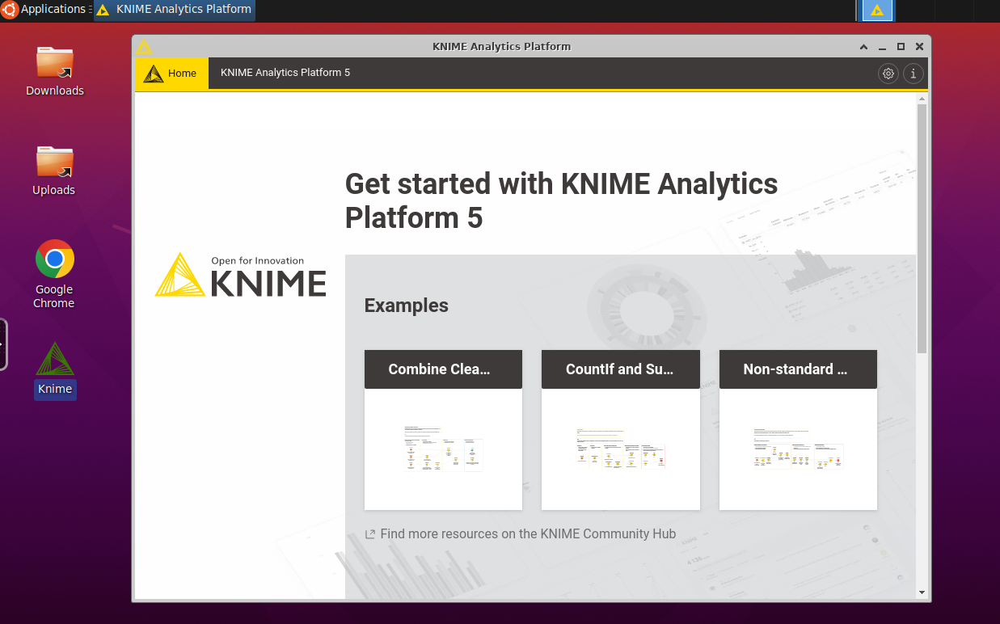

# Knime

Example CI/CD pipeline showing how to deploy Knime to elestio.

This comes with several softwares pre-installed:

- Chrome
- Wine (Windows compatibility, you can install/run any windows program)

All the data is persisted in ./data on the host.

Audio is working as well! (thanks to PulseAudio + ffmpeg + jsmpeg + websockets)

 

 

# Once deployed ...

You can connect to your instance with the Web UI:

    https://[CI_CD_DOMAIN]/
    Login: [ADMIN_LOGIN] (set in env var)
    password: [ADMIN_PASSWORD] (set in env var)

&nbsp;

## Credits

This is forked and modified from: https://github.com/kasmtech/workspaces-core-images
